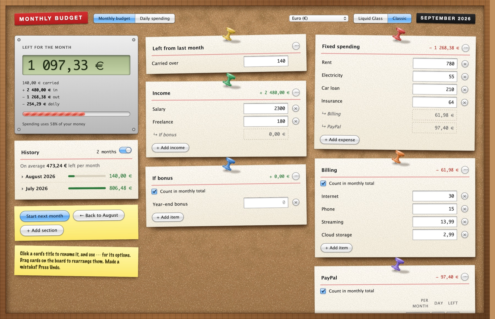
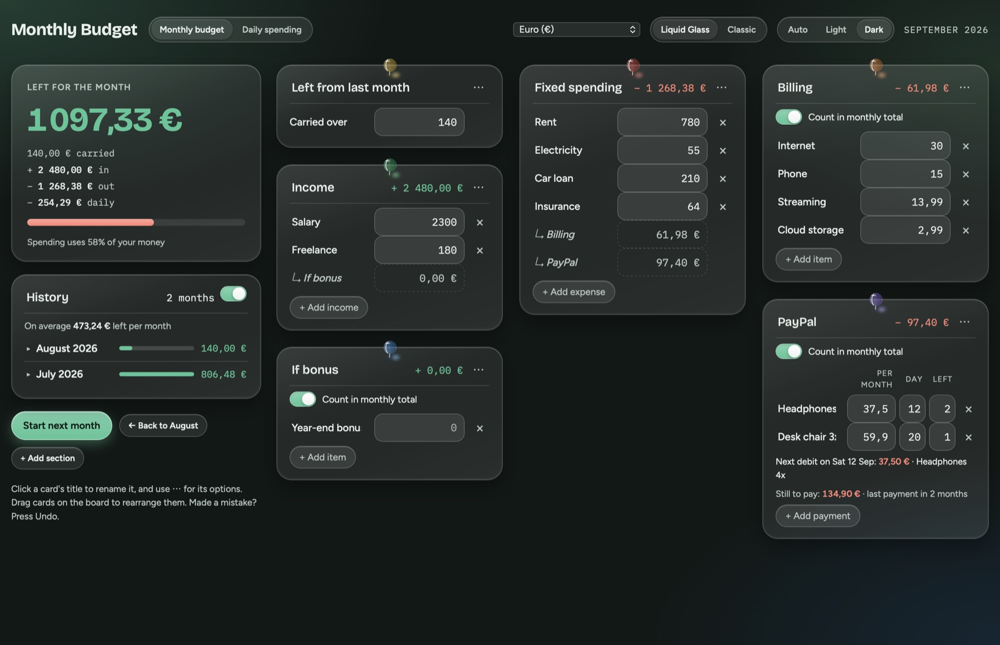
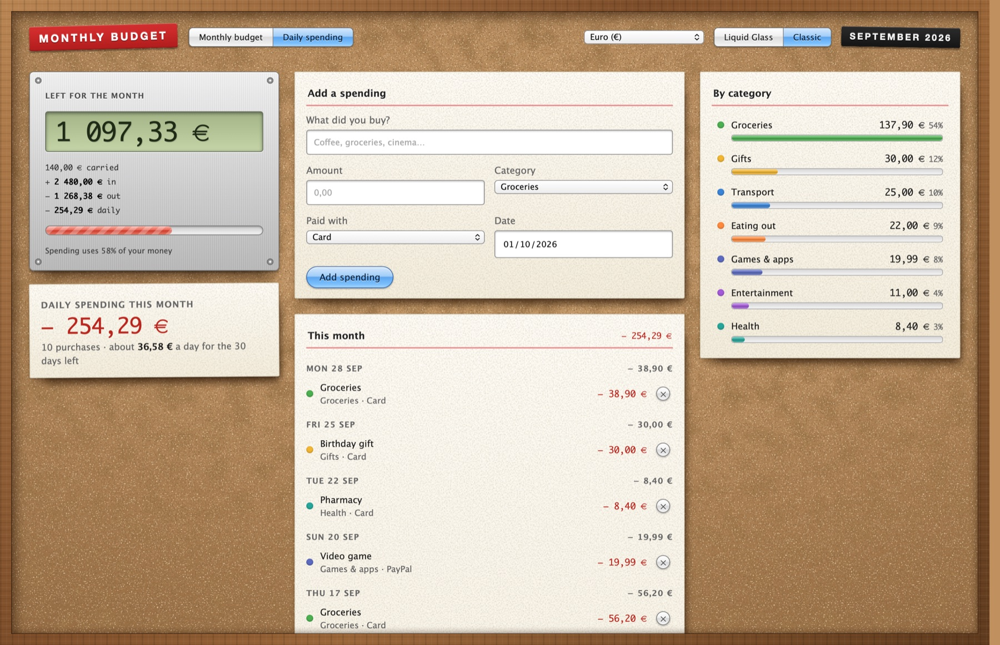
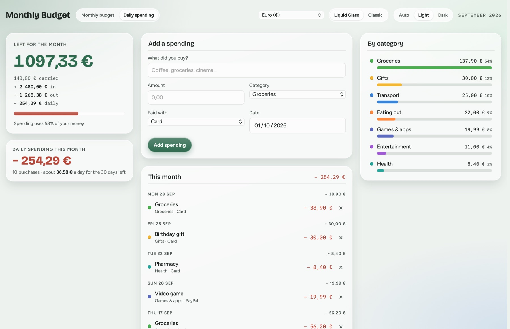

# Monthly Budget

A small Mac app for keeping track of your month: income, fixed spending, bills, installment payments and day-to-day purchases, with what's left always up to date.

It comes in two looks: **Liquid Glass**, with a see-through window, and **Classic**, a cork pinboard in an oak frame inspired by old Mac OS X.





| Daily spending, Classic | Daily spending, Liquid Glass (light) |
| --- | --- |
|  |  |

*The screenshots use a made-up budget (`screenshots/demo.json`).*

## Features

- **Left for the month**: carry-over + income − spending − daily purchases, updated as you type. It turns amber when you're running low and red when you're negative.
- **Sections you control**: add, rename, remove and rearrange cards on the board. Section types:
  - **Income** and **Spending**
  - **Billing lists**: small lists that add into another section (bills, bonuses…)
  - **Installments**: payments spread over months (like PayPal 4x), with payments left, debit day, next debit and what you still owe. Each can be counted in the total or not.
- **Daily spending tab**: log purchases with a category, payment method and date. See totals by category and roughly how much you can spend per day.
- **History**: "Start next month" saves the month you finish, and "Back to last month" reopens it.
- **Undo** for every change you might regret, including across restarts.
- **Amount boxes accept sums** like `45+12,50`, and any number format (`1 234,56`, `1,234.56`, `12 €`).
- **Currencies**: euro, dollar, pound, franc, yen and more (display only, no conversion).
- **Light, dark or follow the system**, just for this app.
- **Private by design**: no account and no internet connection. Everything is saved on your Mac in `~/Library/Application Support/Monthly Budget/`, with automatic daily backups of the last 14 days.

## Download

Get **Monthly-Budget-1.0.zip** from the [latest release](https://github.com/silentrosehill/monthly-budget/releases/latest), unzip it and drag **Monthly Budget** into your Applications folder. It runs on macOS 26 or newer, on Apple silicon and Intel Macs.

The app isn't signed with a paid Apple developer certificate, so the first time you open it macOS will block it. To allow it, open **System Settings → Privacy & Security**, scroll down and click **Open Anyway** next to Monthly Budget. You only need to do this once.

## Build and install

Requirements: macOS 26 or newer (for the Liquid Glass window) and Apple's Command Line Tools (`xcode-select --install`). The build makes one app for both Apple silicon and Intel.

```bash
./build.sh
```

This builds `Monthly Budget.app`, installs it in `~/Applications` and opens it.

## Project layout

| File | What it is |
| --- | --- |
| `src.html` | The whole interface: layout, both looks, and all the budget logic |
| `main.swift` | The Mac window: Liquid Glass background, oak frame, saving and backups |
| `build.py` | Builds the page the app loads from `src.html` |
| `build.sh` | Builds and installs the app |
| `gen_textures.py` | Generates the cork and paper textures (`cork.css.txt`) |
| `icon/` | App icon and the script that draws it |
| `fonts/` | Bundled fonts and their licenses |
| `tools/screenshots.swift` | Renders the README screenshots from `screenshots/demo.json` |

## License

The code is under the [MIT License](LICENSE). The bundled fonts are under the SIL Open Font License; see [fonts/README.md](fonts/README.md).
